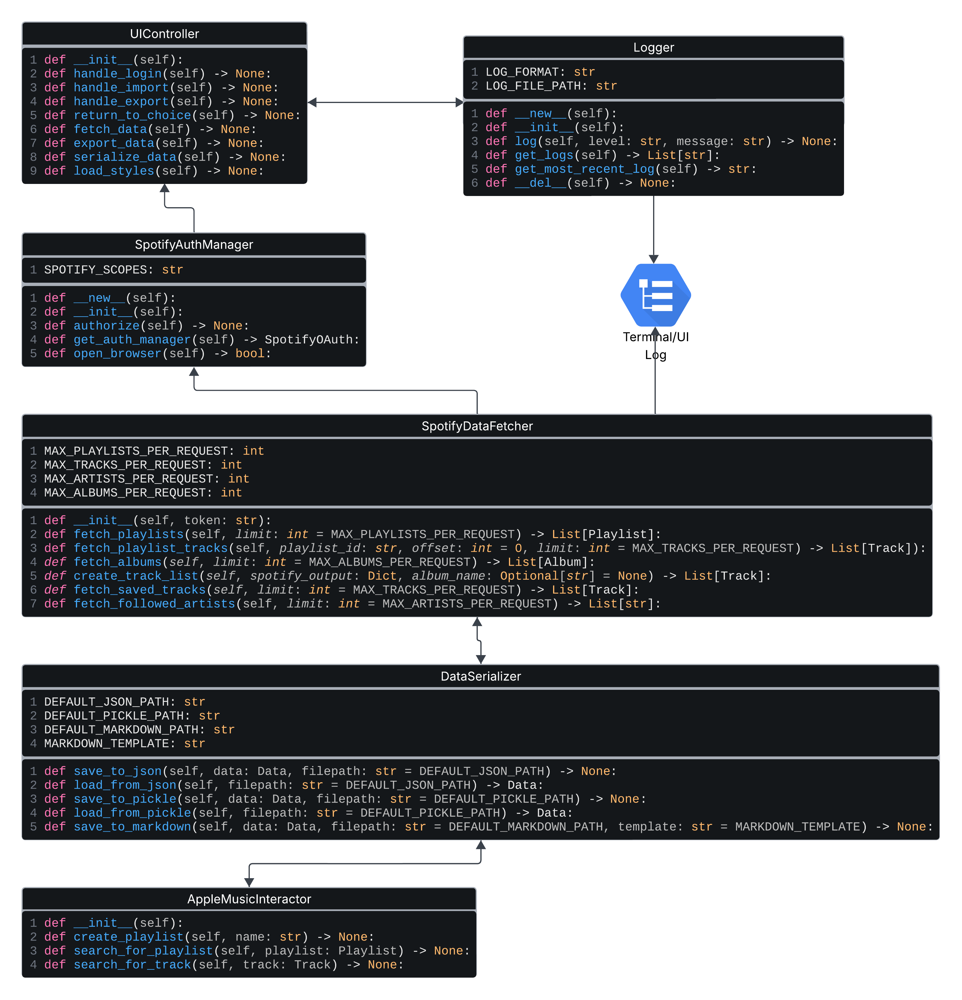

# 🎧 Spotify to Apple Music Migration App Plan

## 🧠 Pre-AppalHack Planning

### ✅ Core Goals
- [x] Define scope of Minimum Viable Product
- [x] Identify data to transfer (playlists, liked songs, followed artists)
- [x] Decide on local-only Apple Music importing
- [x] Choose packaging tool (Briefcase)
- [x] Select libraries and such: Python, PyQt6, dotenv, AppleScript

---

### 📐 Design & Architecture
- [x] Identify functional modules
    | Module Name        | Responsibility                                             |
    |--------------------|------------------------------------------------------------|
    | SpotifyAuthManager | Handle Spotify OAuth login and manage tokens               |
    | SpotifyDataFetcher | Query Spotify API for data                                 |
    | DataSerializer     | Pickles/Unpickles or reads/writes to human-readable format |
    | AppleMusicInjector | Runs AppleScript commands to import data to Apple Music    |
    | UIController       | PyQt UI Manager                                            |
    | Logger             | Track state, messages, and errors                          |
    | SecretManager      | Fetch Spotify secret from a simple cloud backend           |
- [x] Outline user flow
    ```javascript
    Start
     │
     ▼
    [Login to Spotify]
     │
     ▼
    [Fetch Data Options]
     ├──► Fetch Playlists
     ├──► Fetch Liked Songs
     └──► Fetch Followed Artists
           ↓
    [Choose Output]
     ├──► Export to File (json/txt/md)
     └──► Send Directly to Apple Music
           ↓
    [Execute Migration]
           ↓
    [Show Success/Error]
           ↓
    End
    ```
- [x] Outline basic text UML diagram
    ```
    ┌──────────────┐
    │ UIController │◄────────────────┐
    └─────────▲────┘                 │
              │                      │
    ┌─────────┴──────────┐       ┌───▼────┐
    │ SpotifyAuthManager │       │ Logger │
    └─────────▲──────────┘       └───▲────┘
              │                      │
    ┌─────────┴──────────┐           ▼
    │ SpotifyDataFetcher │────► (error/info)
    └─────────▲──────────┘
              │
    ┌─────────▼──────┐
    │ DataSerializer │
    └─────────▲──────┘
              │
    ┌─────────▼──────────┐
    │ AppleMusicInjector │
    └────────────────────┘
    ```
    
- [x] Outline file tree
    ```
    spotify-to-apple/
    │
    ├── main.py
    ├── constants.py
    ├── .env                         # Spotify secret environment variables
    ├── requirements.txt
    ├── README.md                    # Usage & setup instructions
    ├── .gitignore
    │
    ├── assets/
    │
    ├── models/
    │   ├── __init__.py
    │   └── data.py                  # Data objects
    │
    ├── auth/
    │   ├── __init__.py
    │   ├── spotify_auth.py          # SpotifyAuthManager
    │   └── secret_manager.py        # Fetch secret from backend
    │
    ├── spotify/
    │   ├── __init__.py
    │   └── fetcher.py               # SpotifyDataFetcher
    │
    ├── applemusic/
    │   ├── __init__.py
    │   ├── injector.py              # AppleMusicInjector
    │   └── scripts/                 # AppleScript script templates
    │       ├── create_playlist.applescript
    │       ├── add_track.applescript
    │       ├── favorite_track.applescript
    │
    ├── serializer/
    │   ├── __init__.py
    │   └── serializer.py            # DataSerializer
    │
    ├── ui/
    │   ├── __init__.py
    │   ├── controller.py            # UIController
    │   └── screens/
    │       ├── login.py
    │       ├── data_select.py
    │       ├── export_options.py
    │       ├── progress_view.py
    │       └── styles.css
    │
    ├── logs/
    │   ├── __init__.py
    │   ├── logger.py
    │   └── log.txt
    │
    └── tests/
        ├── __init__.py
        ├── test_auth.py
        ├── test_fetcher.py
        └── test_injector.py
    ```
- [x] Outline data objects
    ```python3
    class Track:
        name: str
        artist: List[str]
        album: Optional[str]
        id: str

    class Playlist:
        name: str
        description: str
        cover_image: List[Dict[str, Optional[int] | str]]
        tracks: List[Track]

    class Album:
        name: str
        artists: List[str]
        id: str
        tracks: List[Track]

    class Data:
        playlists: List[Playlist]
        albums: List[Album]
        liked_songs: List[Track]
        followed_artists: List[str]
    ```
- [ ] Plan error handling and testing
- [x] Design human-readable file export format (JSON/Markdown)

---

## 🚀 AppalHack Main Tasks

### 🛠 Backend Functionality
- [x] Set up Spotify OAuth
- [x] Build `SpotifyAuthManager` class to deal with tokens
- [x] Query for followed artists
- [x] Query for playlists
- [x] Query for saved albums
- [x] Query for liked songs
- [x] Serialize and export user data
- [x] Build `DataSerializer` for pickling

---

### 🎶 Apple Music Integration
- [x] Write `AppleMusicInjector` wrapper around AppleScript
- [x] Create playlists via AppleScript
- [x] Search for tracks via AppleScript

---

## 🚀 AppalHack Stretch Tasks

### 🖼 UI Development (PyQt6)
- [x] Build login screen
- [x] Build data selection screen
- [ ] Add export options screen
- [x] Add AppleScript import options
- [x] Add progress bar/logging panel
- [x] Final UI polish with Figma?

---

### 📦 Packaging
- [ ] Package the project as a standalone `.app` with Briefcase
- [ ] Test app
- [ ] Handle missing dependencies

---

### ☁️ Backend Setup
- [ ] Plan backend for storing Spotify secret
- [ ] Choose platform (e.g., AWS)
- [ ] Test basic Flask app for OAuth handoff

---

## Extra stuff
- [ ] Cover image support for playlists
